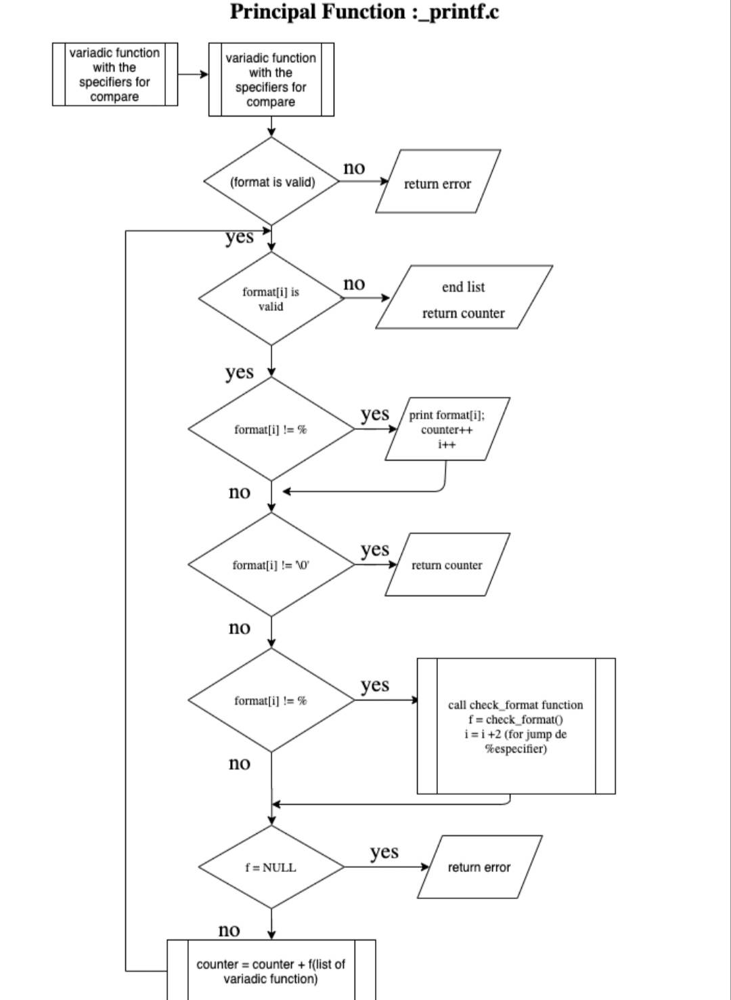
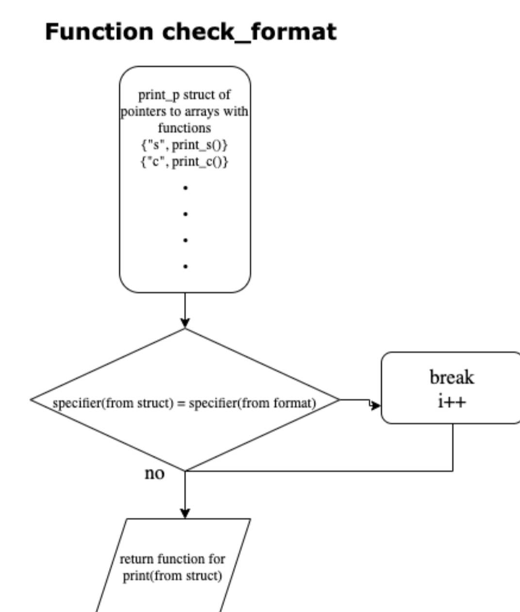

# printf
Printf projects for two collaborators

# PROJECT _PRINTF FUNCTION _printf(). Repository: printf

_printf is a function to do formatted printing. In this program we develop the function for simple printing and the format specificatrions printing.

Depending of the content in the (), this functions use the simple printing or the use or specifiers.

In this project we made the tasks 0 - 2 of mandatory part, and the 14 advanced tasks.

The first task develop the function as such, only with the c, s and % specifiers. Then, the next task, add more specifiers.

We used a principal function called _printf() for give the string or specifiers to other function called check_format. In this second function search wich specifier is and and send it to other funtion that prints the correspondent argument.

For understand how it works we can use this flow chart.

# usage 
For useit you need all the files in the repository.

# File Functions

## _printf.c
Own Printf Function That Performs Formatted 
Output Conversion And Print Data.
## main.h
Header File Where All Prototypes Are Saved.
## get_print_func.c
Pointer To A Function That Selects The 
Correct Function To Perform The Operation.
## print_chr.c
Function That Prints The Buffer.

## handl_buf.c

Function That Concatenates The Buffer Characters.

## print_chr.c

Function That Writes The Character C To Stdout.

/* Indetifier : %c */

## print_str.c

Function That Writes The String To Stdout.

/* Indetifier : %s */

## print_int.c

Function That Prints An Integer.

/* Indetifier : %i or %d */

## print_bnr.c

Function That Prints Decimal In Binary.

/* Indetifier : %b */

## print_oct.c

Function That Prints Decimal In Octal.

/* Indetifier : %o */
## print_hex.c

Function That Prints Decimal In Hexadecimal.

/* Indetifier : %x */

## print_upx.c

Function That Prints Decimal In Uppercase Hexadecimal.

/* Indetifier : %X */

## print_usr.c

Function That Prints A String And Values Of Non-Printed Chars.

/* Indetifier : %S */

## print_unt.c

Function That Prints An Unsigned Integer.

/* Indetifier : %u */

## print_rev.c

Function That Writes The String To Stdout In Reverse.

/* Indetifier : %r */

## print_rot.c

Function That Writes The String To Stdout In Rot13.

/* Indetifier : %R */

## print_add.c

Function That Prints The Address Of An Input Variable.

/* Indetifier : %p */

## print_long_oct.c

Function That Prints Long Decimal Number In Octal.

/* Indetifier : %lo */

## print_long_hex.c

Function That Prints Long Decimal Number In Hexadecimal.

/* Indetifier : %lx */

## print_long_int.c

Function That Prints A Long Integer.

/* Indetifier : %li */

## print_long_upx.c

Function That Prints A Long Decimal In Uppercase Hexadecimal.

/* Indetifier : %lX */

## print_long_unt.c

Function That Prints A Long Unsigned Integer.

/* Indetifier : %lu */

## print_short_oct.c

Function That Prints Short Decimal Number In Octal.

/* Indetifier : %ho */

## print_num_upx.c

Function That Prints A Number In Uppercase Hexadecimal.

/* Indetifier : %#X */

## print_plus_int.c

Function That Prints An Integer With Plus Symbol.

/* Indetifier : %+i */

## print_space_int.c

Function That Prints An Integer Begining With 0 And u.

/* Indetifier : % i */

## ev_print_func.c

Function That Returns The Amount Of Indetifiers.

# Author's 
 
AUWAL ABDULMALIK (auwalamalik@gmail.com)
DAUDA SHERIFFDEEN DAYO (s.dayo36@yahoo.com)
